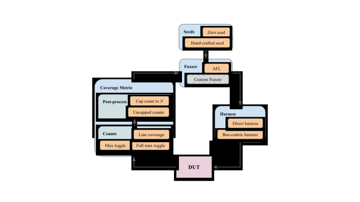

# RTLFuzzLab: a modular hardware fuzzing framework

RTLFuzzLab is designed to allow for easy experimentation with Coverage Directed Mutational Fuzz Testing on RTL designs.



For details about RTLFuzzLab, please see our abstract released in WOSET 2021.

[Abstract](https://woset-workshop.github.io/WOSET2021.html#article-10)

Fajardo, Brandon and Laeufer, Kevin and Bachrach, Jonathan and Sen, Koushik. **RTLFUZZLAB: Building A Modular Open-Source Hardware Fuzzing Framework.** *In Workshop on Open-Source EDA Technology (WOSET)*, November, 2021.

## Installation

### Dependencies
The following dependencies are required to run this software:
* make
* gcc
* g++
* java
* sbt
* verilator
* matplotlib
* scipy


### Get AFL Fork
```.sh
git clone https://github.com/ekiwi/AFL
cd AFL
make
```
This AFL fork is functionally identical to upstream AFL.
Our version produces some additional meta-data that is used to produce better plots.


### Clone repo
```.sh
git clone https://github.com/ekiwi/rtl-fuzz-lab
```

### Run setup script (setup.sh)
```.sh
./setup.sh
```
This will create two fifos (`a2j` and `j2a`), a `seeds` directory and compile the proxy to interface with AFL.

## Usage
### Populate seeds folder
Existing seeds are available in the folder: `rtl-fuzz-lab/src/fuzzing/seeds/binary`

Example:
```.sh
cp src/fuzzing/seeds/binary/TLI2C_shortSeed.hwf seeds
```

### Run fuzzing script (fuzz.sh)
Takes in arguments: `FIRRTL Harness Minutes Out_folder Iterations AFL_path`

Example:
```.sh
./fuzz.sh test/resources/fuzzing/TLI2C.fir tlul 1 results/example 3 ~/AFL
```
This will set certain environment variables for AFL. Modify the script to manually control AFL.

#### Arguments:
* FIRRTL: FIRRTL design which is to be fuzzed

> Existing FIRRTL designs can be found under test/resources/fuzzing

* Harness: Method for applying input bytes to the hardware design

> Current available harness options: rfuzz (direct), tlul (bus-centric)

> The tlul harness should only be used on TL FIRRTL designs, as it is bus-centric to TL-UL designs

* Minutes: Number of minutes to fuzz for (per fuzzing iteration)
* Out_folder: Folder in which to output fuzzing results
* Iterations: Number of iterations to performing fuzzing using current parameters
* AFL_path: Path to forked AFL folder


### Plot results
Takes in arguments: `do_average PATH [PATH ...]`

Example:
```.sh
python3 plotCoverage.py true results/example
```

> Run script with -h option to get script information

> Produces png of plot at coveragePlot.png


## Acknowledgment
Integrating AFL with our Scala based fuzz bench would not have been possible without the awesome AFL proxy infrastructure from the [JQF](https://github.com/rohanpadhye/JQF) project.

## License
This code is open-source under a BSD license. See the `LICENSE` file for more information.
